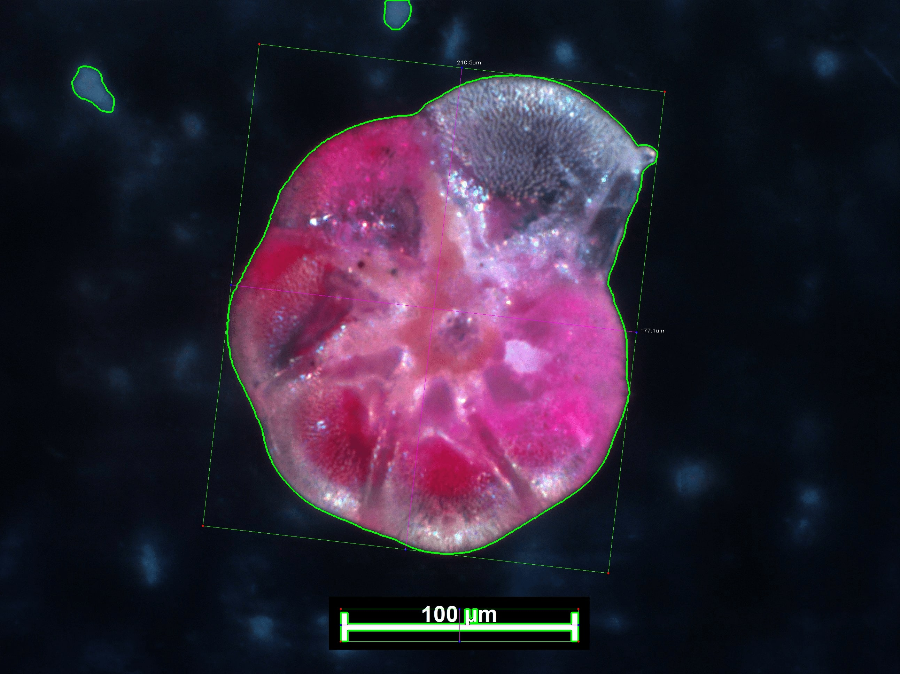

---
html_document:
  theme: readable
  highlight: default
  dev: png
  toc: yes
  toc_float: yes
  number_sections: yes
author: "Thaise R Freitas, Eduardo T Bacalhau, Carla C Bonetti"
date: "`r Sys.Date()`"
title: '`forImage` vignette'
vignette: |
  %\VignetteIndexEntry{Getting started with forImage R package} 
  %\VignetteEngine{knitr::rmarkdown_notangle} 
  %\VignetteEncoding{UTF-8}
bibliography: references.bib
---

```{r init,echo=FALSE}
is_check <- ("CheckExEnv" %in% search()) || any(c("_R_CHECK_TIMINGS_",
             "_R_CHECK_LICENSE_") %in% names(Sys.getenv()))
knitr::opts_chunk$set(warning=FALSE, message=FALSE, cache=FALSE, 
                      comment=NA, verbose=TRUE, purl = FALSE, eval = !is_check)
```

## Introduction

Biovolume is a valuable non-destructive option to estimate foraminiferal biomass. Time and effort are the usual constrains associated with biovolume method through manual and semi-automatic measurements, which are often more susceptible to bias [@mazurkiewicz2016a]. These limitations lead us to develop the `forImage` package as an alternative to manual and/or multi-software dependent methods for biometry and biomass estimation. This and other issues were considered during the package development to guide size data acquisition and processing, to turn biomass estimation friendlier to non-experts in biometry and expand the use of foraminiferal biomass in marine ecology and paleoecology.

## Installation

The `forImage` is available in [GitHub](https://github.com/ThaiseRF/forImage). To install the package via GitHub use:

```{r eval=FALSE}
remotes::install_github("ThaiseRF/forImage")

```

The package **requires** Python \>= 3.5

```{r, results="hide", warning=FALSE, message=FALSE}
# loading the package
library(forImage)

```

Use `install_measure()` to install all Python modules dependencies at once in a virtual environment. This function is a wrapper of [reticulate](https://rstudio.github.io/reticulate/reference/py_install.html) `py_install()` and requires a `conda` installation on Windows.

## Package data

The package contains the raw format of the following data:

-   photomicrograph of *Ammonia parkinsoniana* from the Potiguar Basin (NE Brazil) (`.tif` + metadata `.xml`)
-   test measurements from several foraminiferal species (`.csv`), that were grouped in genus, and are available in the package.
-   mean ± SD percent cell occupancy (`pco`) of the test of 73 Foraminifera genera individually measured, along with matching geometric model. See `data_pco`

These data were included to exemplify how the package is used within distinct morphological shapes and to illustrate the measurement acquisition.

To import the example photomicrograph use:

```{r}
img <- system.file("extdata", "foram.tif", package="forImage")

```

To load the package size data use:

```{r}
data("ammonia") 
data("bolivina") 

head(ammonia)
```

## Volumetric calculations

The `ammonia` data contains test height (`h`), minor (`d_one`) and major diameter (`d_two`), surface area (`area`) and percent of cell occupancy of 867 individuals from two species of genus *Ammonia* that were previously measured individually. We calculate the test volume for this genus using the ellipsoid model as follows:

```{r warning=FALSE}
volume.total(ammonia, model = '10hl')

total <- dplyr::bind_rows("ammonia" = ammonia, "bolivina" = bolivina, .id = "genus")
total$model[total$genus == "ammonia"] <- "10hl"
total$model[total$genus == "bolivina"] <- "13hlsl"

volume.total(total)

```

The models volume formulas can be assessed in `?volume.total`

For all genus that were already allocated in the best fitted geometric model (see `??data_pco`), is possible to calculate the biovolume directly using the argument `genus`, which will not only set the geometric model but also attribute a specific `pco`. If the genus is unknown the `model` argument can be used to calculate biovolume. Then the default is `pco = 0.76`. Here is a few of the genus that also contain example data.

+---------------------+-----------------------------------+
| `genus`             | geometric model                   |
+=====================+:=================================:+
| "ammonia"           | ellipsoid                         |
+---------------------+-----------------------------------+
| "amphistegina"      | cone or double cone               |
+---------------------+-----------------------------------+
| "angulogerina"      | cone + half-ellipsoid             |
+---------------------+-----------------------------------+
| "asterotrochammina" | paraboloid                        |
+---------------------+-----------------------------------+
| "bolivina"          | gomphonemoid                      |
+---------------------+-----------------------------------+
| "cibicidoides"      | half sphere                       |
+---------------------+-----------------------------------+
| "discorbinella"     | dome                              |
+---------------------+-----------------------------------+
| "laevipeneroplis"   | prolate spheroid                  |
+---------------------+-----------------------------------+
| "loxostomina"       | prism on elliptic base            |
+---------------------+-----------------------------------+
| "nonionella"        | half-elliptic prism               |
+---------------------+-----------------------------------+
| "patellina"         | cone                              |
+---------------------+-----------------------------------+
| "quinqueloculina"   | triangular dipyramid or ellipsoid |
+---------------------+-----------------------------------+
| "rectocibicides"    | area x height                     |
+---------------------+-----------------------------------+
| "spirillina"        | cylinder                          |
+---------------------+-----------------------------------+
| textularia"         | elliptic cone                     |
+---------------------+-----------------------------------+

```{r}
vt <- bio.volume(total)
head(vt)

```

## Estimate biomass

Organic carbon biomass can finally be individually calculated from informed biovolume and the chosen conversion factor as `method` argument. The default conversion factor of [@michaels1995] is used when the `method` is omitted

| Reference       |    `method`    |  Conversion factor   |
|-----------------|:--------------:|:--------------------:|
| @saidova1967    |  `"saidova"`   | 0.1027gC~org~.cm^-3^ |
| @strathmann1967 | `"strathmann"` | 0.110pgC~org~.cm^-3^ |
| @gerlach1985    |  `"gerlach"`   | 0.113gC~org~.cm^-3^  |
| @turley1986     |   `"turley"`   | 0.132pgC~org~.cm^-3^ |
| @putt1989       |    `"putt"`    | 0.140pgC~org~.cm^-3^ |
| @michaels1995   |  `"michaels"`  | 0.089pgC~org~.cm^-3^ |

```{r}
bt <- biomass(vt, method = "gerlach")
head(bt)
```

## Measurement acquisition

In case you don't have size data available to estimate biomass, you can measure the test size from photomicrographs with the `measure` function. This function is partly written in Python via the `reticulate` R package.

Let's take a look into this specimen:

```{r echo=FALSE, out.width = "50%", fig.align='center'}
library(raster)
plotRGB(brick(img))

```

To measure the specimen run:

```{r}
m <- measure(img)
m
```

In this case, we are only measuring the individual's size, and the function only returns a data frame with surface area, major and minor axis measured. To decrease the processing time and allow the processing of several images at once, the resulted images are not plotted, but can be saved as `.png` files in a chosen directory if `save = TRUE`.

Let's see the resulted image:

<center>

{width=50%}

</center>

More than one specimen in the same image can be measure at the same time, yet this should be used with caution to not decrease the accuracy. The possibility of assessing the percent of cell occupancy via the `measure` function is also under development.

### Scaling

If the photomicrograph contains metadata is possible to access the scaling information directly. The metric/pixel information `scale` or a reference scale `ref_scale` can be also used in the `measure` function to set the correct scaling.

### Thickness / Z-depth

Not only the pixel size but also the z-stack information (if available) can be accessed via the metadata. This function is still under construction to access other types of image metadata.

```{r}
meta <- system.file("extdata", "foram.tif_meta.xml", package="forImage")
meta <- depth.xml(meta)
meta

m$z_depth <- meta$z_depth

```

The measured specimen data can be wrangled to fit the volumetric functions requirements.

```{r}
library(magrittr)
library(dplyr)
df <- m %>% 
  rowwise() %>% 
  mutate(h = case_when(diamA > diamB ~ diamA, TRUE ~ diamB),
         d_two = case_when(diamA > diamB ~ diamB, TRUE ~ diamA),
         d_one = z_depth) %>%
  select(-diamA, -diamB, -z_depth)
  
df <- bio.volume(df, genus = "ammonia")
biomass(df, method = "gerlach")
```

## Summary and other comments

-   This package was developed to automatize the acquisition of foraminiferal size data and biomass estimation in a open-source environment.
-   It synthesize information to expand the method usability.

To obtain satisfactory results is important to keep in mind:

1.  Image quality

2.  Focus range

3.  Lighting

4.  Processed images revision

## References
